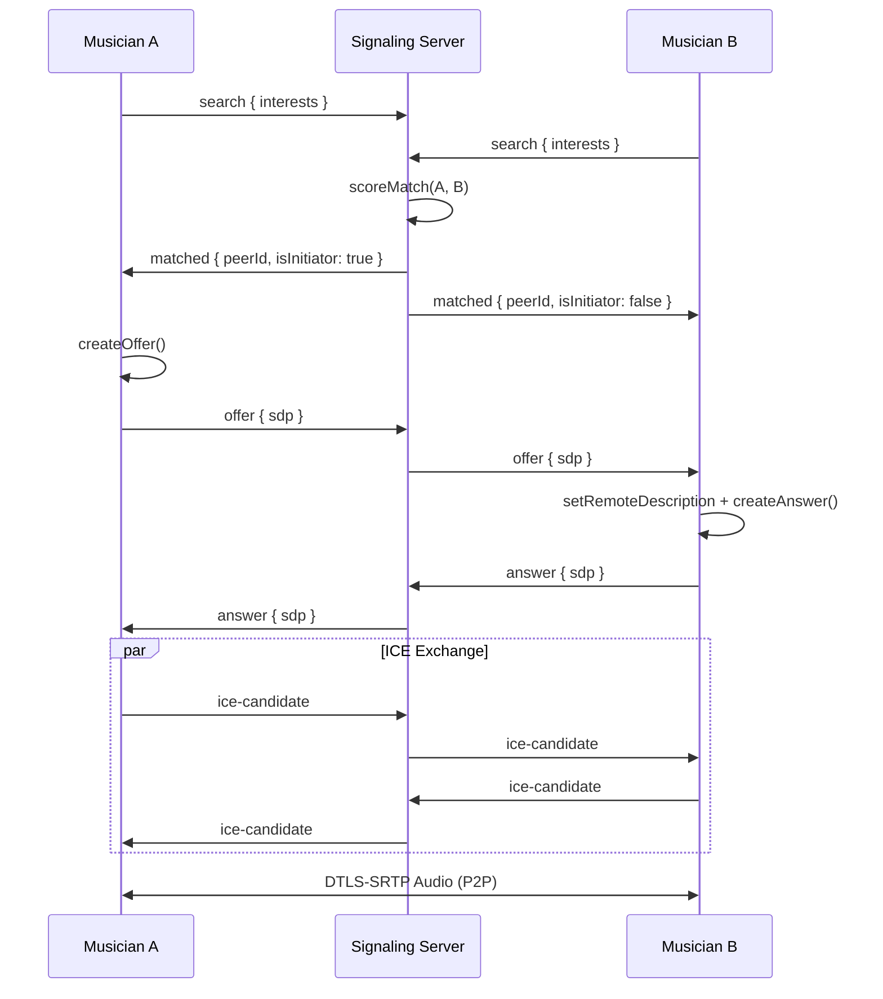

# System Architecture — JamLink

## Overview

JamLink is a distributed real-time audio matchmaking system consisting of a **Next.js frontend**, a **Node.js signaling backend**, and **WebRTC peer-to-peer audio** between matched musicians.

```
┌─────────────────────────────────────────────────────────────────────────┐
│                           CLIENT (Browser)                              │
│  ┌──────────────┐  ┌──────────────┐  ┌──────────────────────────────┐  │
│  │   Next.js    │  │  Socket.IO   │  │      WebRTC Audio Engine     │  │
│  │     UI       │◄─┤   Client     │  │  RTCPeerConnection + Media   │  │
│  └──────────────┘  └──────┬───────┘  └──────────────┬───────────────┘  │
└───────────────────────────┼──────────────────────────┼──────────────────┘
                            │ WebSocket                │ UDP (SRTP)
                            ▼                          ▼
┌─────────────────────────────────────────────────────────────────────────┐
│                      SIGNALING SERVER (Node.js)                         │
│  ┌──────────────┐  ┌──────────────┐  ┌──────────────┐  ┌────────────┐  │
│  │  Socket.IO   │  │ Match Queue  │  │  Jam Relay   │  │Rate Limiter│  │
│  │   Handlers   │  │  + Scoring   │  │   Manager    │  │            │  │
│  └──────────────┘  └──────────────┘  └──────────────┘  └────────────┘  │
└─────────────────────────────────────────────────────────────────────────┘
                            │
                            ▼
              ┌─────────────────────────────┐
              │   STUN / TURN (optional)    │
              │   NAT traversal & relay     │
              └─────────────────────────────┘
```

## Component Responsibilities

### Frontend (`frontend/`)

| Module | Responsibility |
|--------|----------------|
| `app/page.tsx` | Main orchestrator: UI state, signaling + WebRTC coordination |
| `hooks/useSignaling.ts` | Socket.IO connection, match events, SDP relay |
| `hooks/useWebRTC.ts` | RTCPeerConnection lifecycle, ICE, media streams |
| `hooks/useAudioAnalyser.ts` | Microphone level for voice orb & VAD |
| `components/*` | UI: interest grid, voice orb, call controls |
| `lib/webrtc.ts` | Audio constraints, peer connection factory |

### Backend (`backend/`)

| Module | Responsibility |
|--------|----------------|
| `index.ts` | Express HTTP server, Socket.IO bootstrap, health endpoints |
| `signaling/handlers.ts` | All socket events: search, match, SDP, ICE, report |
| `matchmaking/queue.ts` | Interest-scored queue, anti-repeat matching |
| `jam/mixRelay.ts` | Multi-user jam rooms, clock sync, frame relay |
| `moderation/rateLimiter.ts` | Token-bucket rate limits per user |

## 1:1 Match Flow



## Signaling Protocol

All signaling uses **Socket.IO** over WebSocket (with polling fallback).

### Connection Lifecycle

1. Client connects → server emits `connected` with `userId` + `iceServers`
2. Server broadcasts `presence-update` with online count
3. On disconnect → peer notified via `peer-disconnected`

### Matchmaking Algorithm

```
score = (shared_interests × 10)
      + (priority_tag_matches × 5)
      + (same_mode ? 3 : 0)
      - (recently_matched ? 100 : 0)
```

Highest-scoring queue pair is matched. Initiator alternates based on `joinedAt` timestamp.

## WebRTC Audio Path

```
Microphone
    │
    ▼
getUserMedia({ echoCancellation, noiseSuppression, autoGainControl })
    │
    ▼
RTCPeerConnection.addTrack()
    │
    ▼  (DTLS-SRTP encrypted)
Peer Network ──► remote MediaStream ──► <audio> element
```

ICE servers from environment are injected at connection time. Browser handles:
- Jitter buffer
- Packet loss concealment (PLC)
- Adaptive bitrate

## Jam Mode Architecture

```
┌──────────┐     ┌──────────┐     ┌──────────┐
│ Musician │     │ Musician │     │ Musician │
│    1     │     │    2     │     │    3     │
└────┬─────┘     └────┬─────┘     └────┬─────┘
     │                │                │
     └────────────────┼────────────────┘
                      │
                      ▼
            ┌─────────────────────┐
            │   Jam Relay Server  │
            │  - Room management  │
            │  - Clock sync       │
            │  - Frame relay      │
            │  - Regional routing │
            └─────────────────────┘
```

Jam rooms form when 2+ users search in `jam` mode within the same region. Each participant establishes mesh WebRTC connections. Server relays timestamped audio frame metadata for clock alignment.

## Security Model

| Layer | Protection |
|-------|------------|
| Transport | WSS (TLS) for signaling |
| Media | DTLS-SRTP (WebRTC mandatory) |
| Identity | Anonymous UUID per session |
| Abuse | Rate limits + report + disconnect |
| Privacy | No persistent user profiles |

## Scalability Considerations

| Concern | Approach |
|---------|----------|
| Signaling | Stateless handlers; horizontal scale with Redis adapter for Socket.IO |
| Media | P2P — no server media load for 1:1 calls |
| Jam Mode | Regional edge relays; optional SFU for >4 participants |
| Matchmaking | In-memory queue per instance; shard by region at scale |

## Deployment Topology

```
                    ┌─────────────┐
                    │   Vercel    │
                    │  (Frontend) │
                    └──────┬──────┘
                           │ HTTPS
                           ▼
                    ┌─────────────┐
                    │  Railway /  │
                    │   Render    │
                    │  (Backend)  │
                    └──────┬──────┘
                           │
              ┌────────────┼────────────┐
              ▼            ▼            ▼
        ┌──────────┐ ┌──────────┐ ┌──────────┐
        │   STUN   │ │   TURN   │ │  Redis   │
        │  (free)  │ │ (paid)   │ │ (scale)  │
        └──────────┘ └──────────┘ └──────────┘
```

## Health & Observability

- `GET /health` — uptime, connections, queue sizes
- `GET /api/stats` — online count, searching count
- Report events logged server-side with timestamp

## File Map

```
backend/src/
├── index.ts              # Entry point
├── types.ts              # Shared interfaces
├── signaling/handlers.ts # Socket event handlers
├── matchmaking/queue.ts  # Match scoring & queue
├── jam/mixRelay.ts       # Jam room manager
└── moderation/rateLimiter.ts

frontend/src/
├── app/page.tsx          # Main page orchestrator
├── hooks/
│   ├── useSignaling.ts
│   ├── useWebRTC.ts
│   └── useAudioAnalyser.ts
├── components/           # UI components
└── lib/
    ├── webrtc.ts
    ├── socket.ts
    └── interests.ts
```
